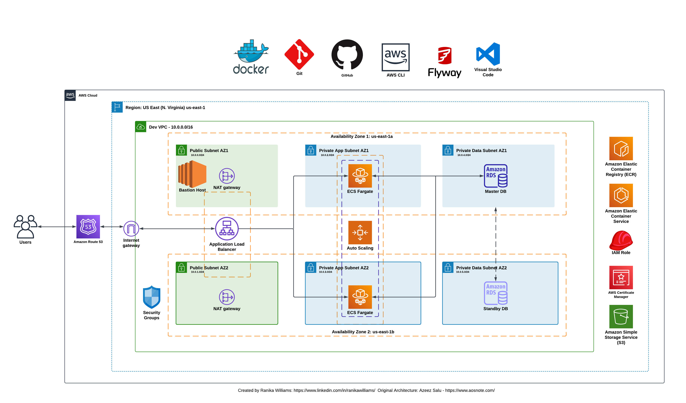

# Deploy a Dynamic Web Application on AWS with Terraform, Docker, Amazon ECR, and ECS

## Project Overview
This project demonstrates the deployment of a dynamic web application leveraging containerization and orchestration services provided by AWS. The infrastructure is defined using Terraform, ensuring the deployment is automated and repeatable. The architecture of this deployment includes the following components:

- **Docker**: To build container images for the web application.
- **GitHub**: To manage and version control the application code and Dockerfile.
- **AWS CLI**: To interact with AWS services.
- **Flyway**: To migrate SQL data into the RDS database.
- **Amazon ECR**: To store Docker images.
- **Amazon ECS**: To run containerized applications using Fargate.
- **3-Tier VPC**: With public and private subnets spread across two availability zones.
- **Internet Gateway & NAT Gateways**: To manage internet access for VPC resources.
- **Amazon RDS (MySQL)**: For the relational database.
- **Application Load Balancer**: To distribute web traffic across ECS tasks.
- **Auto Scaling Group**: To dynamically manage ECS tasks.
- **Route 53**: For domain name registration and DNS management.
- **Amazon S3**: To store environment variable files.
- **IAM Role**: To manage permissions for ECS tasks.
- **Bastion Host**: Used to set up an SSH tunnel.
- **Security Groups**: To control traffic to and from resources.
- **Certificate Manager**: To encrypt data in transit.

## Architectural Diagram:

## Learning Outcomes
During this project, I gained valuable insights and hands-on experience in several key areas:

- Containerization with Docker: I learned how to create Docker images and manage containers, making the application more portable and consistent across different environments.
- Infrastructure as Code (IaC) with Terraform: I deepened my understanding of defining and deploying infrastructure using Terraform scripts, enabling automated and repeatable deployments.
- AWS Services Integration: I gained experience integrating multiple AWS services, such as ECS, ECR, RDS, S3, and more, to build a comprehensive application infrastructure.
- Networking in AWS: I learned to design and configure a 3-tier VPC and manage subnets, gateways, and security groups to ensure secure and efficient network communication.
- Database Management with Flyway: I acquired knowledge in managing database migrations using Flyway, ensuring database schema consistency across different environments.
- Load Balancing and Auto Scaling: I understood the importance of load balancing and auto-scaling in maintaining application availability and performance under different load conditions.
- Security Best Practices: I learned how to implement security best practices, including using IAM roles, security groups, and AWS Certificate Manager to secure data and manage permissions.

